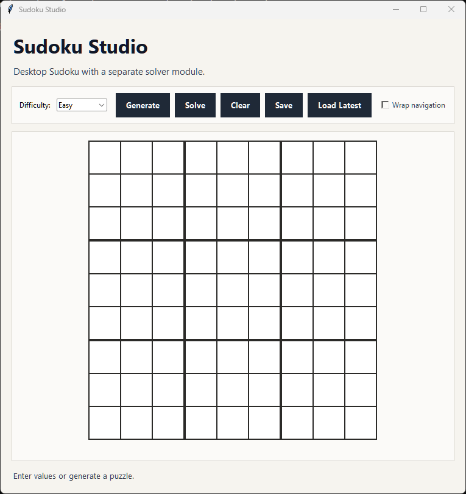
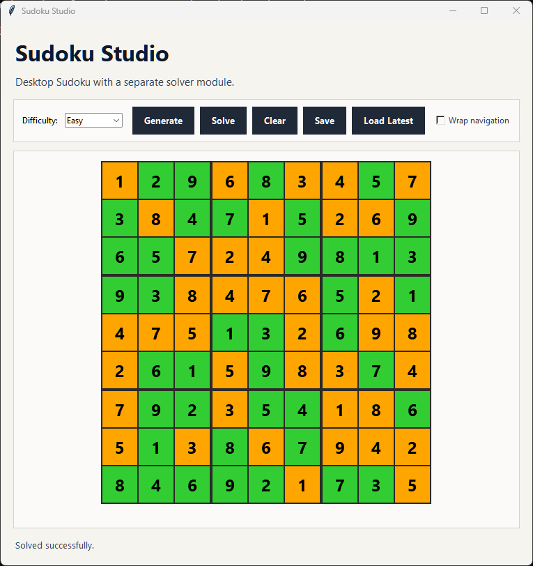
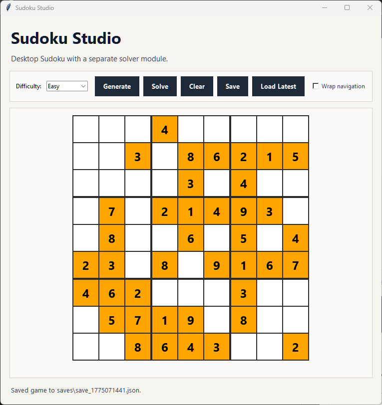

# Sudoku Solver

Sudoku desktop application with a Tkinter interface and a separate solver module.

## Features

- Backtracking Sudoku solving and random puzzle generation
- Difficulty presets from the desktop UI configuration
- Save and load game states as JSON files under `saves/`
- Desktop color metadata for user-entered and solved cells

## Requirements

- Python 3.10+

## Run The Desktop App

On Windows:

```bat
run_windows.bat
```

On other platforms:

```bash
python tkinter_gui.py
```

## Project Layout

- tkinter_gui.py: Tkinter desktop interface
- solver.py: Sudoku solving, generation, and save/load logic
- ui_config.py: labels, colors, difficulty presets, and UI options
- saves/: saved game states
- run_windows.bat: Windows launcher that creates or activates `venv`

## Screenshots

### Main Window



### Solved Board



### Save and Load



## Notes

- Saved games are stored as JSON files in `saves/`.
- Solver logic remains separate from the Tkinter UI.